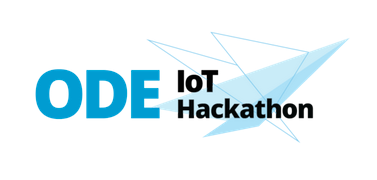

# ODE Hackathon
## Hintergrund
OpenSource als Garant für innovative Technologien: Beim ODE.OpenDataEcosystem IoT Hackathons dreht sich alles um Künstliche Intelligenz und das Internet der Dinge. Sie gelten als die wichtigsten Treiber der industriellen und zivilgesellschaftlichen Digitalisierung der 20er Jahre dieses Jahrhunderts. Im Rahmen der Hackathons möchten wir den Teilnehmenden die Nutzung von Open Source IoT für Wirtschaft, Wissenschaft und Kultur vermitteln und beispielhaft Einsatzfelder definieren um IoT Anwendungen auf OpenSource Basis zu entwickeln.

Mehr zur Motivation der Initiative gibt es [hier](https://it-tech-up.de/it-strategie/data) zu lesen.

## Technik im Einsatz
Wir nutzen ein offenes Sensor Terminal mit einer Vielzahl bereits integrierter Sensoren auf Arduino Basis mit WLAN Konnektivität und einem integrierten Display. Die Sensorik des Sensor Terminals lässt sich durch verschiedener Grove Module (>300) auf eine Vielzahl von Messumgebungen adaptieren. Damit stehen den Teilnehmern des Hackathons vielfältige Anwendungsfälle offen, die unkompliziert auf der ODE Open Source Cloud registriert und weiter verarbeitet werden können. Auf der ODE Open Source Cloud wurde ein Kubernetes Cluster mit einer infinimesh IoT Plattform, einer Timeseries und Grafana zur Visualisierung der Daten installiert und ermöglicht damit den Teilnehmern Ende-zu-Ende IoT Projekte zu realisieren. Nähere Informationen zur Steuerung der Sensoren findet sich [hier auf GitHub](https://github.com/infinimesh/sensorterminal-quickstart).

## Mitmachen
Alle Interessierten sind eingeladen der Community auf [Keybase](https://keybase.io/team/ode_hackathon) beizutreten. Informationen zur nächsten Runde wird es bald hier zu finden geben.

## Weitere Hackathons
Im Januar 2022 wird es noch einen Hackathon zum Thema Verkehr geben. Darüber hinaus wird es eine Veranstaltung speziell zur Visualisierung aller bis dahin gesammelten Daten geben. Alle weiteren Infos dazu werden hier zeitnah veröffentlicht werden.

Darüber hinaus freuen wir uns auch über neue Ideen aus der Community und organisieren gerne weitere Termine.

## 2. Runde
Am 19. Dezember ging es mit einer zweiten (virtuellen) Runde zum Usecase "Alge" weiter.

## 1. Runde
Am 17. November 2021 fand die erste Runde des ODE.OpenDataEcosystem IoT Hackathons statt. Dabei ging es um die vier Themenfelder Alge, Verkehr, Solar und LoRaPark.
Hier ein paar Impressionen der Veranstaltung am 17.11.2021:

## Partner
* [Infinite Devices](https://www.infinitedevices.io/)
